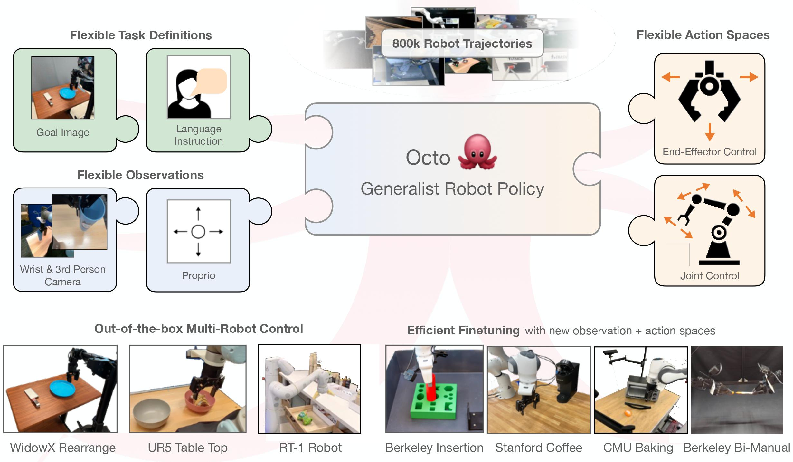

# Octo-PyTorch

[](https://githubtocolab.com/emb-ai/octo-pytorch/blob/pytorch/examples/01_pt_inference_pretrained.ipynb)

This repo contains code for training and finetuning [Octo](https://octo-models.github.io/) generalist robotic policies (GRPs) using PyTorch framework (a.k.a. **OctoPt**).
Base architecture and fine-tuning procedures were reimplemented from the original repo, which can be useful for further research related to robotic manipulation.
We tried to keep the code as close as possible to the original JAX implementation, but some parts were reimplemented from scratch.

## Get Started

Follow the installation instructions, then load a pretrained Octo model!
See the examples for guides to zero-shot [evaluation](examples/01_pt_inference_pretrained.ipynb) and [finetuning](examples/02_pt_finetune_new_observation_action.ipynb) examples.

You can load original JAX weights directly from [HuggingFace](https://huggingface.co/rail-berkeley) or any provided local checkpoint and use it for PyTorch module initialization. 

```python
from octo.model.octo_model_pt import OctoModelPt
model = OctoModelPt.load_pretrained_from_jax("hf://rail-berkeley/octo-small-1.5")['octo_model']
```

Or from PyTorch checkpoint:

```python
from octo.model.octo_model_pt import OctoModelPt
model = OctoModelPt.load_pretrained(checkpoint_path)['octo_model']
```




## Installation
```bash
conda create -n octo_pt python=3.10
conda activate octo_pt
pip install -e .
pip install -r requirements.txt
pip install torch torchvision
pip install accelerate
```

Note: Since we use JAX only for loading weights, we do not need a JAX version with CUDA support.

See the [Jax Github page](https://github.com/google/jax) for more details on installing Jax.

Test the installation by finetuning on the debug dataset:
```bash
torchrun --nproc_per_node 1 scripts/finetune_pt.py --config.pretrained_path=hf://rail-berkeley/octo-small-1.5 --debug
```

## Checkpoints

You can find the original pretrained Octo checkpoints for JAX [here](https://huggingface.co/rail-berkeley).
At the moment, the authors provide the following model versions:

| Model                                                         | Size       |
|---------------------------------------------------------------|------------|
| [Octo-Base](https://huggingface.co/rail-berkeley/octo-base)   | 93M Params |
| [Octo-Small](https://huggingface.co/rail-berkeley/octo-small) | 27M Params |


## Examples

We provide simple [example scripts](examples) that demonstrate how to use and finetune Octo models,
as well as how to use our data loader independently. We provide the following examples:

|                                                                      |                                                                                                                    |
|----------------------------------------------------------------------|--------------------------------------------------------------------------------------------------------------------|
| [OctoPt Inference](examples/01_pt_inference_pretrained.ipynb)             | Minimal example for loading weights from JAX model checkpoint and running an OctoPt model                                                    |
| [OctoPt Finetuning](examples/02_pt_finetune_new_observation_action.py)    | Minimal example for finetuning a pretrained OctoPt model on a small dataset with a new observation and action space |
| [OctoPt Rollout](examples/03_pt_eval_finetuned.py)                        | Run a rollout of a pretrained OctoPt policy in a Gym environment                                                     |
| 


## OctoPt Finetuning

We provide a [minimal example](examples/02_pt_finetune_new_observation_action.py) for finetuning with a new observation and action space.

We also provide a more advanced finetuning script that allows you to change hyperparameters via a config file and logs finetuning
metrics. To run advanced finetuning, use:
```bash
torchrun --nproc_per_node 8 scripts/finetune_pt.py --config.pretrained_path=hf://rail-berkeley/octo-small-1.5
```

Finetuning running arguments are kept the same as in the original [JAX implementation](https://github.com/octo-models/octo?tab=readme-ov-file#octo-finetuning).

## Initializing OctoPt Model with Weights from JAX Checkpoint

### Instantiation from JAX Checkpoint 

The simplest way to instantiate the new `OctoModelPt` from JAX checkpoint:

```python
from octo.model.octo_model_pt import OctoModelPt
loaded_dict = OctoModelPt.load_pretrained_from_jax("hf://rail-berkeley/octo-small-1.5")
model = loaded_dict['octo_model']
```

The `loaded_dict` contains a ready-to-use torch model in `loaded_dict['octo_model']`, raw JAX weights in `loaded_dict['jax_params']` and lists of missing and skipped keys in `loaded_dict['missing_keys']` and `loaded_dict['skipped_keys']` respectively.

Since the text tokenizer is frozen during training, we **initialize it directly from HuggingFace**.
Therefore, text tokenizer weights are always missing during loading.
To suppress warning messages about missing parameters, you can explicitly specify the keys to be skipped using a regular expression:

```python
loaded_dict = OctoModelPt.load_pretrained_from_jax("hf://rail-berkeley/octo-small-1.5", skip_keys_regex='.*hf_model')
model = loaded_dict['octo_model']
```

### Instantiation from the Configuration

More often, you might want to make modifications to the architecture (add extra heads or tokenizers, or change the default action head).
In such cases, it is better to initialize the model from the configuration and load weights manually.
Here is how you can do it:

```python
meta = OctoModelPt.load_config_and_meta_from_jax("hf://rail-berkeley/octo-small-1.5")
```

The `meta` contains everything you need for instantiation: configuration, example batch, dataset statistics, and text processor.
You can modify the configuration as you wish (all information about model architecture is stored in `meta['config']['model']`).
For example, you may want to use an L1 Action Head instead of a Diffusion Head and use an additional observation tokenizer for the secondary image.

First, change the action head:

```python
meta['config']['model']['heads'] = {'action': {
    'args': [],
    'kwargs': {
        'input_dim': 384,
        'action_horizon': 4,
        'dropout_rate': 0.0,
        'action_dim': 7,
        'readout_key': 'readout_action',
    },
    'module': 'octo.model.components.action_heads_pt',
    'name': 'L1ActionHeadPt'
    }
}
```

Or more elegant variant using `ModuleSpec.create`:

```python
from octo.utils.spec import ModuleSpec
from octo.model.components.action_heads_pt import L1ActionHeadPt

meta['config']['model']['heads'] = ModuleSpec.create(
        L1ActionHeadPt,
        input_dim=384,
        action_horizon=4,
        action_dim=7,
        readout_key="readout_action",
    )
```

Then add observation tokenizer for `secondary` image:

```python
from octo.model.components.vit_encoders_pt import SmallStem16Pt
from octo.model.components.tokenizers_pt import ImageTokenizerPt

meta['config']['model']['observation_tokenizers']['secondary'] = ModuleSpec.create(
    ImageTokenizerPt,
    encoder = ModuleSpec.create(
        SmallStem16Pt
    ),
    obs_stack_keys = ["image_secondary"],
    task_stack_keys = ["image_secondary"]
)
```

We also have to provide the number of input tokens for all observations and tasks.
Since we added new input (secondary image), we need to update number of tokens in the configuration:

```python
meta['config']['model']['num_tokens_dict'] = {
    'primary': 256,
    'secondary': 256, # add this item
    'wrist': 64,
    'language': 16,
    'action': 1
}
```

Lastly, we have to update `meta['example_batch']` and `meta['dataset_statistics']` according to the new data.
Then we call constructor:

```python
model = OctoModelPt.from_config(
        **meta
    )
```

Then we can initialize weights of the new model from the JAX checkpoint 

```python
missing_keys, skipped_keys = model.load_weights_from_jax("hf://rail-berkeley/octo-small-1.5", skip_keys_regex='.*hf_model')
```

Note: In this case, there will be some missing parameters corresponding to the new modules and skipped parameters corresponding to the old Diffusion Head.

You can refer to [OctoPt finetuning example](examples/02_pt_finetune_new_observation_action.py) for more information.

### Non-Strict Initialization

Sometimes you may not want to initialize some parameters from the JAX checkpoint.
For example, if you change the action horizon from 4 to 8 in the default pretrained model:

```python
meta = OctoModelPt.load_config_and_meta_from_jax("hf://rail-berkeley/octo-small-1.5")

# change horizon
meta['config']['model']['heads']['action']['kwargs']['action_horizon'] = 8 

model = OctoModelPt.from_config(
        **meta
    )
model.load_weights_from_jax("hf://rail-berkeley/octo-small-1.5")
```

The code snippet above gives an assertion error, because of parameter mismatch in the action head:

```python
AssertionError: New value of 'heads.action.diffusion_model.reverse_network.linear1.weight' has shape torch.Size([256, 444]), but torch.Size([256, 472]) expected
```

More specifically, you have a shape mismatch in weights and biases in the `diffusion_model.reverse_network` modules.
For finetuning, this is not critical, and we can skip them:

```python
model.load_weights_from_jax("hf://rail-berkeley/octo-small-1.5", 
    skip_keys_regex=".*diffusion_model.reverse_network.[linear1|linear2]"
)
```

However, we can use slighly better initialization than random for these modules and use non-strict weights initialization:

```python
model.load_weights_from_jax("hf://rail-berkeley/octo-small-1.5", 
    non_strict_keys_regex=".*diffusion_model.reverse_network.[linear1|linear2]"
)
```
